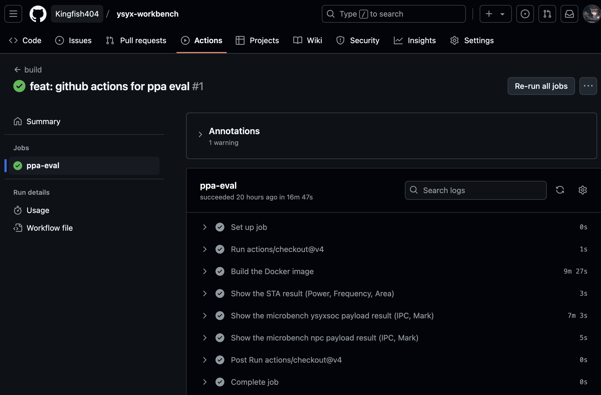
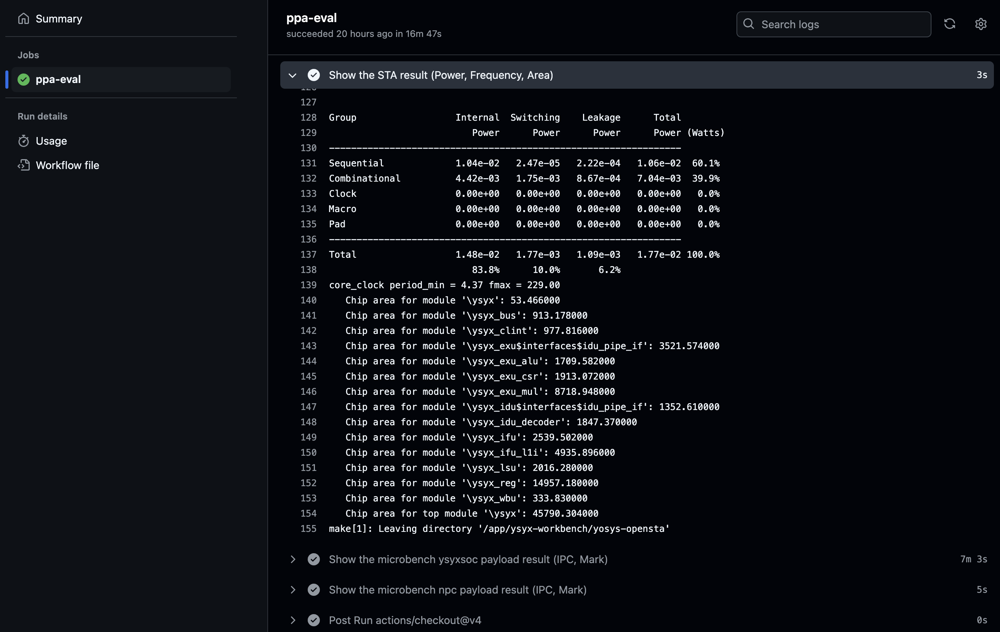
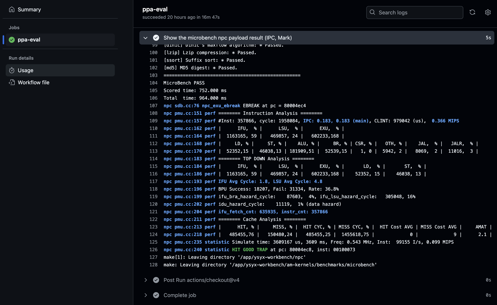

<style>
h1 {
  margin: 0;
  padding: 0;
}
.columns {
  display: grid;
  grid-template-columns: auto auto;
}
</style>

# 现代开源`ASIC/FPGA`工程链路使用与经验分享
## 工欲善其事，必先利其器
### 金宇 ysyx_23060087

---

# About this sharing

- 主要介绍现代开源`ASIC/FPGA`工程链路的**个人**使用经验，高度概括和综述
- 免责声明：本人主要的`ASIC/FPGA`工程链路使用经验来自于`ysyx`项目的开发实践
  - 本人主业上无IC设计背景，其中使用的工具或者看法可能不是最优的
  - 每个人的工程链路使用习惯可能不同，欢迎交流
- “一生一芯” 2023年10月至今｜通过C认证，学号：ysyx_23060087，https://docs.qq.com/sheet/DRkdzQ0xsVFNvdEhF
- 软件：完成RV32/64IM行为模拟器NEMU，能够运行RT-Thread，nanos-lite (PA4.2)
- 硬件：完成多周期顺序4集单发射流水线 RV32IM 处理器设计和开发，个人额外还实现了FPGA移植（Tang-nano-20k），基于OpenSTA的PPA评估。 (SystemVerilog)

---
# Documentation: riscv-unified-db

https://riscv-software-src.github.io/riscv-unified-db/manual/html/landing/index.html

<iframe src="https://riscv-software-src.github.io/riscv-unified-db/manual/html/landing/index.html" width="100%" height="100%"></iframe>

---
# Documentation: rvcodecjs

https://luplab.gitlab.io/rvcodecjs/

<iframe src="https://luplab.gitlab.io/rvcodecjs/" width="100%" height="100%"></iframe>

<div class="columns"><div>

</div><div>

</div></div>

---
# Software Engineering

- [Conventional Commits](https://www.conventionalcommits.org/en/v1.0.0/): `feat: finish pa4.1`, `fix: axi4 write stall`
```
<type>[optional scope]: <description>
...
```
- [Semantic Versioning 2.0.0 | Semantic Versioning](https://semver.org/)
```
版本格式：主版本号.次版本号.修订号，版本号递增规则如下：
1. 主版本号：当你做了不兼容的 API 修改，
2. 次版本号：当你做了向下兼容的功能性新增，
3. 修订号：当你做了向下兼容的问题修正
```

---
# Software Engineering
- [Keep a Changelog](https://keepachangelog.com/en/1.1.0/)

<iframe src="https://keepachangelog.com/zh-CN/1.1.0/" width="100%" height="100%"></iframe>

---
# Compile: RTL -> Syn -> PnR (FPGA)

- RTL sim: verilator, https://github.com/verilator/verilator
  - fst wave format, microbenchmark: npc 23 MB，ysyxsoc 71 MB (vcd N GB)
    - https://veripool.org/guide/latest/faq.html#how-do-i-generate-fst-waveforms-traces-in-c-or-systemc
- Syn: YosysHQ/yosys: https://github.com/YosysHQ/yosys
```tcl
yosys ltp -noff
yosys show -format dot -prefix ./out/${mod_name} -viewer none
```
- PnR: YosysHQ/nextpnr https://github.com/YosysHQ/nextpnr (Gowin 高云 FPGA)
  - https://github.com/Kingfish404/ysyx-workbench/tree/master/fpga/gowin-tang-nano-20k

---
# Verification & Tools
- formal: 
  - symbiyosys
    - ysyx docs: i cache verification
    - my case: AXI4 verification, multi-cycle mul/div verification (equ. check)
- Tools:
  - waveviewer: `surfer`, https://gitlab.com/surfer-project/surfer
  - fpga loader: `openFPGALoader`, https://github.com/trabucayre/openFPGALoader
  - sd cards flashing: `balenaEtcher`, https://github.com/balena-io/etcher

---
# Tools: surfer - Waveform Viewer

<iframe src="https://app.surfer-project.org/?load_url=https://app.surfer-project.org/picorv32.vcd&startup_commands=show_quick_start;module_add%20testbench.top" width="100%" height="500px"></iframe>

---
## IDE
- IDE: vscode, https://github.com/microsoft/vscode

## VSCode Extension - 0
- vscode extension:
  - Verilog-HDL/SystemVerilog/Bluespec SystemVerilog
    - https://marketplace.visualstudio.com/items?itemName=mshr-h.VerilogHDL
    - https://github.com/mshr-h/vscode-verilog-hdl-support
  - Verible
    - https://marketplace.visualstudio.com/items?itemName=CHIPSAlliance.verible
    - https://github.com/chipsalliance/verible

---
## VSCode Extension - 1
  - Scala (Metals)
    - https://marketplace.visualstudio.com/items?itemName=scalameta.metals
    - https://github.com/scalameta/metals-vscode
  - Scala Syntax (official)
    - https://marketplace.visualstudio.com/items?itemName=scala-lang.scala
    - https://github.com/scala/vscode-scala-syntax
- vscode extension (closed source):
  - Serial Monitor
    - https://marketplace.visualstudio.com/items?itemName=ms-vscode.vscode-serial-monitor


---
## Install the tools - via homebrew or oss-cad-suite-build

[Homebrew](https://brew.sh/) or [YosysHQ/oss-cad-suite-build](https://github.com/YosysHQ/oss-cad-suite-build)

## oss-cad-suite-build Installation
1. Download an archive matching your OS from [the releases page](https://github.com/YosysHQ/oss-cad-suite-build/releases/latest).
2. Extract the archive to a location of your choice (for Windows it is recommended that path does not contain spaces)
3. On macOS to allow execution of quarantined files ```xattr -d com.apple.quarantine oss-cad-suite-darwin-x64-yyymmdd.tgz``` on downloaded file, or run: ```./activate``` in extracted location once.
4. Set the environment as described below.

---
## Install homebrew and `brew bundle` the ` Brewfile`

```ruby
tap "chipsalliance/verible"
tap "coursier/formulas"
tap "homebrew/bundle"
tap "riscv-software-src/riscv"

brew "verilator"
brew "yosys"

brew "openjdk@17"
brew "scala"
brew "metals"
brew "mill"

brew "riscv-software-src/riscv/riscv-openocd"
brew "riscv-software-src/riscv/riscv-pk"
brew "riscv-software-src/riscv/riscv-tools"

brew "surfer"
brew "openfpgaloader"

cask "balenaetcher"
cask "visual-studio-code"

vscode "mshr-h.veriloghdl"
vscode "chipsalliance.verible"
vscode "scala-lang.scala"
vscode "scalameta.metals"

vscode "ms-vscode.vscode-serial-monitor"
```

---
# Yosys + OpenSTA: PPA Evaluation

YSYX has already provided [OSCPU/yosys-sta](https://github.com/OSCPU/yosys-sta), why we need yet another?

Motivation: 
- [OSCPU/yosys-sta](https://github.com/OSCPU/yosys-sta) **not support** `report_power`, [OSCC-Project/iEDA](https://github.com/OSCC-Project/iEDA) support it, but **hard to compile** and the envirement it provide is outdated. 
- [parallaxsw/OpenSTA](https://github.com/parallaxsw/OpenSTA) **support** `report_clock_min_period`, `report_power`, and `report_clock_min_period`. And support `Build with Docker`

What is the trade-off?: 
- `OpenSTA` does not support `fixfanout`, so the evaluated result would be lower than `yosys-sta`. But it is enough to use for development evaluation.

Finally: [Kingfish404/yosys-opensta](https://github.com/Kingfish404/yosys-opensta/), an alternate for [OSCPU/yosys-sta](https://github.com/OSCPU/yosys-sta)

---

# CI/CD: GitHub Actions

https://github.com/Kingfish404/ysyx-workbench/actions/runs/12517984211/job/34919672975





---
# CI/CD: GitHub Actions show case

<div class="columns"><div>


</div><div>


</div></div>

---
## Dockerfile
```dockerfile
FROM --platform=linux/amd64 homebrew/brew:latest

RUN brew install verilator yosys mill
RUN sudo apt update && \
    sudo apt install -y \
        gcc g++ gcc-riscv64-linux-gnu g++-riscv64-linux-gnu \
        wget cmake curl llvm \
        tcl-dev tcl-tclreadline libeigen3-dev swig bison automake autotools-dev \
        libsdl2-dev libsdl2-image-dev libsdl2-ttf-dev flex \
        libreadline-dev libncurses5-dev libncursesw5-dev

WORKDIR /app
RUN git clone https://github.com/Kingfish404/ysyx-workbench
WORKDIR /app/ysyx-workbench/
RUN git clone https://github.com/kingfish404/am-kernels && \
    git clone https://github.com/Kingfish404/ysyxSoC && \
    git clone https://github.com/Kingfish404/yosys-opensta
```

To be continued...

---

Following the previous Dockerfile,

```dockerfile
# setting environment variables
ENV YSYX_HOME=/app/ysyx-workbench
ENV NEMU_HOME=${YSYX_HOME}/nemu
ENV AM_HOME=${YSYX_HOME}/abstract-machine
ENV NPC_HOME=${YSYX_HOME}/npc
ENV CROSS_COMPILE=riscv64-linux-gnu-

# Prepare STA env: https://github.com/parallaxsw/OpenSTA
WORKDIR /app/ysyx-workbench/yosys-opensta/

RUN make init && \
    wget https://raw.githubusercontent.com/davidkebo/cudd/main/cudd_versions/cudd-3.0.0.tar.gz && \
    tar -xvf cudd-3.0.0.tar.gz && \
    rm cudd-3.0.0.tar.gz
# Build CUDD
RUN cd cudd-3.0.0 && \
    mkdir ../cudd && \
    ./configure && \
    make -j`nproc`
# Get NANGATE45
RUN make init && git clone https://github.com/parallaxsw/OpenSTA.git

WORKDIR /app/ysyx-workbench/yosys-opensta/OpenSTA/
RUN cmake -DCUDD_DIR=../cudd-3.0.0 -B build . && cmake --build build -j`nproc`

WORKDIR /app/ysyx-workbench/npc/ssrc
RUN make verilog -j`nproc`

WORKDIR /app/ysyx-workbench/ysyxSoC
RUN git clone https://github.com/chipsalliance/rocket-chip.git && \
    make dev-init && \
    make verilog -j`nproc`

WORKDIR /app/ysyx-workbench/npc
RUN make o2_defconfig && \
    sed -i 's/-Werror//' Makefile && \
    sudo touch /usr/riscv64-linux-gnu/include/gnu/stubs-ilp32.h && \
    make -j`nproc` && \
    make sta_local
RUN make o2soc_defconfig && \
    make -j`nproc`

CMD ["bash"]
```

---

# .github/workflow/build.yml

```yaml
name: build

on:
  push:
    branches: ["master", "main"]
  pull_request:
    branches: ["master", "main"]

jobs:
  ppa-eval:
    runs-on: ubuntu-latest

    steps:
      - uses: actions/checkout@v4
      - name: Build the Docker image
        run: docker build . --file Dockerfile --tag sta:latest --build-arg CACHEBUST=$(date +%s)
      - name: Show the STA result (Power, Frequency, Area)
        run: docker run sta:latest make sta_local
      - name: Show the microbench ysyxsoc payload result (IPC, Mark)
        run: docker run sta:latest make -C /app/ysyx-workbench/am-kernels/benchmarks/microbench ARCH=riscv32e-ysyxsoc run mainargs="test" FLAGS="-b -n"
      - name: Show the microbench npc payload result (IPC, Mark)
        run: docker run sta:latest bash -c "make o2_defconfig && make -C /app/ysyx-workbench/am-kernels/benchmarks/microbench ARCH=riscv32e-npc run mainargs="test" FLAGS="-b -n""
```

[feat: github actions for ppa eval · Kingfish404/ysyx-workbench@910671a](https://github.com/Kingfish404/ysyx-workbench/actions/runs/12517984211/job/34919672975)

---
# Summary
```yaml
Documentation: riscv-unified-db, rvcodecjs
Software Engineering: 
  Conventional Commits, Semantic Versioning, Keep a Changelog
Compile: verilator, yosys, nextpnr
Verification and Tools:
  symbiyosys, surfer, openFPGALoader, balenaEtcher
IDE: vscode
VSCode Extension: 
  - Verilog-HDL/SystemVerilog/Bluespec SystemVerilog
  - Verible
  - Scala (Metals)
  - Scala Syntax (official)
  - Serial Monitor
Install the tools: homebrew, oss-cad-suite-build
Yosys and OpenSTA: PPA Evaluation
CI/CD: GitHub Actions
```

This slides is made by: https://github.com/marp-team/marp using `markdown`

---

# One Last Thing

## Happy new year and merry christmas

## Live long and prosper

